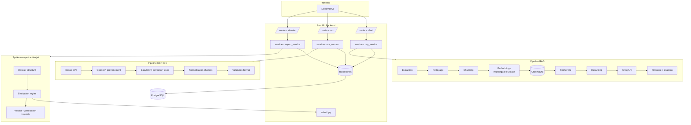
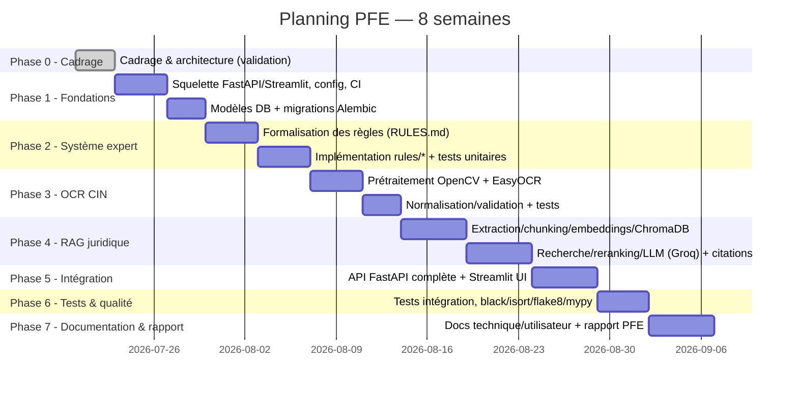

# ARCHITECTURE.md — Proposition initiale (Phase 0, à valider)

> ⚠️ **Document historique (V1).** Décrit l'architecture proposée et vérifiée pour la
> première version du projet. **La référence actuelle du projet est `CONCEPTION_V2.md`**,
> complétée par `PROJECT_STATE.md`. Conservé pour la traçabilité de l'évolution.

> Ce document est une **proposition** soumise à validation avant génération de code,
> conformément à la consigne de démarrage. Aucun code n'est produit dans cette phase.

## 1. Vue d'ensemble



## 2. Modules et responsabilités

| Module | Entrée | Traitement | Sortie | Statut ML |
|---|---|---|---|---|
| Chatbot juridique (RAG) | Question utilisateur | Pipeline RAG complet | Réponse + citations (source, niveau, référence) | Embeddings + LLM (Groq) |
| OCR CIN | Image CIN | OpenCV → EasyOCR → normalisation → validation | JSON structuré (nom, prénom, CIN, date naissance) | OCR (pas de ML custom) |
| Système expert anti-rejet | Dossier structuré (formulaire) | Évaluation de règles documentées (`backend/rules/*.py`) | Verdict + liste d'anomalies justifiées | Aucun (rule-based strict) |

## 3. Découpage technique (SOLID)

- **routers/** : contrats HTTP (FastAPI), validation d'entrée/sortie via `schemas/`
  (Pydantic v2). Aucune logique métier.
- **services/** : orchestration métier (ex. `rag_service.py`, `ocr_service.py`,
  `expert_service.py`). Dépend de `repositories/` et `rules/`, jamais l'inverse.
- **repositories/** : accès aux données (PostgreSQL via SQLAlchemy 2.x), migrations
  via Alembic.
- **models/** : entités ORM (SQLAlchemy).
- **schemas/** : DTO Pydantic v2 (entrée/sortie API), distincts des `models/`.
- **rules/** : règles du système expert, regroupées par catégorie (`capital.py`,
  `documents.py`, `identite.py`, `fiscalite.py`, `cnss.py`) ; chaque règle documentée
  dans `backend/RULES.md`.
- **core/** : configuration transverse (logging, exceptions, sécurité).
- **config/** : chargement `.env`, settings typés (Pydantic `BaseSettings`).
- **utils/** : fonctions utilitaires pures, sans dépendance métier.

## 4. Modèle de règle du système expert (structure imposée par le prompt)

Chaque règle doit exposer :
`id`, `catégorie`, `description`, `condition`, `gravité`, `message_utilisateur`,
`justification`, `référence_documentaire`, `niveau_documentaire`.

Exemple conceptuel (non codé à ce stade) basé sur le corpus :
- Règle capital SARL : condition = capital > 100 000 DH ET pas d'attestation de blocage
  bancaire fournie → gravité = bloquante → source = Loi 5-96, art. 51 [S1, Niveau 1] +
  OMPIC/Dar Al Moukawil (suppression du blocage sous 100 000 DH) [S4, S5, Niveau 2/3].

## 5. Décisions techniques à figer

Voir `DECISIONS.md` pour la liste complète et le statut de chaque décision
(validée / à valider par le porteur de projet).

## 6. Planning Gantt (2 mois, 8 semaines)



*(Diagramme visuel interactif fourni en complément dans le chat.)*

## 7. Modélisation UML (Phase 1)

La conception UML complète (cas d'utilisation, classes, séquences, modèle de données)
est détaillée dans `docs/UML.md`. Elle précise et complète les sections 2 à 4
ci-dessus sans les contredire :

- Le diagramme de classes formalise les entités déjà esquissées en section 4
  (`Regle`) et introduit les entités de persistance nécessaires aux 3 modules
  (`Dossier`, `EvaluationDossier`, `Anomalie`, `Question`, `Reponse`, `DocumentCorpus`,
  `Chunk`, `IdentitePersonne`).
- Les diagrammes de séquence détaillent, pour chaque module, le trajet exact
  Streamlit → routers → services → repositories/rules déjà posé en section 3.
- Le modèle de données (ERD) sert de base directe aux futurs modèles SQLAlchemy
  (`backend/models/`) et migrations Alembic (Phase « Fondations techniques »).

## 9. Vérification de la Phase 2 (Règle absolue n°5)

Conformément à l'exigence « le projet doit rester compilable après chaque phase »,
le code produit en Phase 2 a été vérifié dans un environnement Python 3.11+ isolé :

- `py_compile` sur l'ensemble de `backend/`, `frontend/`, `alembic/` : **OK**.
- Import effectif de `backend.main:app` et `backend.models:Base` (12 tables
  détectées, conformes au modèle de données `docs/UML.md` §6) : **OK**.
- `pytest` : 5/5 tests passés (2 unitaires settings, 2 unitaires métadonnées ORM,
  1 intégration `/health`), couverture 96 % sur le code applicatif existant.
- `black`, `isort`, `flake8`, `mypy` : aucune erreur après correction du formatage
  des fichiers Alembic générés.

## 10. Système expert anti-rejet (Phase 3)

Le catalogue complet des 11 règles (capital, documents, identité, fiscalité, CNSS),
leurs sources, niveaux et les 3 contradictions du corpus explicitement non arbitrées
sont détaillés dans `backend/RULES.md`. Le moteur d'évaluation
(`backend/services/expert_service.py`) déduit le statut global d'un dossier
(`conforme` / `conforme_avec_reserves` / `non_conforme`) à partir de la gravité
maximale des anomalies déclenchées, sans jamais laisser une anomalie informative
dégrader un dossier par ailleurs conforme.

**Vérification** : 30/30 tests passés (couverture 97 %), incluant 7 dossiers
synthétiques paramétrés couvrant tous les cas exigés par le cahier des charges. black,
isort, flake8, mypy : tous propres.

## 11. Module OCR CIN (Phase 4)

### 11.1 Choix d'EasyOCR plutôt que Tesseract

Le cahier des charges impose déjà EasyOCR (section « TECHNOLOGIES IMPOSÉES »). Cette
section en confirme et motive le bien-fondé technique :

| Critère | EasyOCR | Tesseract |
|---|---|---|
| Approche | Détection + reconnaissance par apprentissage profond (CRAFT + CRNN) | Moteur historique (LSTM depuis v4), plus sensible aux conditions de capture |
| Robustesse sur photo smartphone (éclairage, angle) | Meilleure, conçu pour des scènes naturelles | Optimisé pour des scans plats et propres |
| Installation | Package Python pur (`pip install`) | Binaire système (`tesseract-ocr`) + paquets de langues, hors `pip` |
| Impact sur la reproductibilité | Compatible avec l'exigence « clone + install sans étape manuelle » | Nécessiterait une installation OS supplémentaire dans le Dockerfile |
| Support multilingue | Natif (Reader multilingue), mais compatibilité exacte fr+ar non certifiée | Paquets de langues séparés (`fra`, `ara`), gérés indépendamment |

**Décision** : EasyOCR est retenu (comme imposé), configuré en français uniquement en
V1 par prudence (voir PROJECT.md §5.2 et DECISIONS.md, Phase 4).

### 11.2 Pipeline

```
Image CIN --> preprocessing.py (OpenCV : niveaux de gris, débruitage, égalisation)
           --> extraction.py (EasyOCR via l'interface MoteurOCR, injectable)
           --> normalization.py (regex : numéro CIN, date, nom/prénom)
           --> validation.py (complétude des 4 champs)
           --> ocr_service.py (orchestration + erreurs + intégration au dossier)
```

### 11.3 Gestion des erreurs

- `ImageIllisibleError` : aucune ligne de texte détectée par l'OCR.
- `ChampsIdentiteIncompletsError` : un ou plusieurs champs obligatoires manquants
  après normalisation (liste précise fournie).
- Le routeur `/ocr/cin` traduit ces erreurs en HTTP 422 avec message explicite ; un
  fichier qui n'est pas une image valide est également rejeté en 422 (avant tout appel
  au moteur OCR).

### 11.4 Intégration au dossier

`vers_identite_personne()` convertit un `ResultatExtractionCIN` en
`IdentitePersonneInput` avec `source_extraction = OCR`, réutilisable directement dans
le dossier de création (`DossierInput.identites`), conformément au modèle de données
de Phase 1 (`docs/UML.md`, §6).

### 11.5 Vérification

50/50 tests passés (couverture 98 %). Le moteur EasyOCR réel (inférence sur modèles ML)
n'a pas été exécuté dans cet environnement de vérification — dépendance trop lourde
(torch) pour ce sandbox ; son contrat est testé via un moteur factice respectant
l'interface `MoteurOCR`. L'import réel d'`easyocr` est différé à l'instanciation et
vérifié uniquement syntaxiquement (`py_compile`) et par mypy (`ignore_missing_imports`).

## 13. Module RAG juridique (Phase 5)

### 13.1 Pipeline d'indexation (offline, `scripts/indexer_corpus.py`)

```
data/raw/*.txt --> extraction.py --> cleaning.py --> chunking.py (LangChain)
               --> chunk_store.py (JSON, data/chunks/) [pour l'index lexical]
               --> embeddings.py (sentence-transformers) --> indexing.py (ChromaDB)
```

### 13.2 Pipeline de requête (online, `backend/services/rag_service.py`)

```
Question --> embeddings.py (vecteur requête)
         --> indexing.py (recherche sémantique, top 5)
         --> lexical_search.py (recherche BM25, top 5)
         --> hybrid_search.py (fusion RRF)
         --> reranking.py (priorité au niveau documentaire, top 4)
         --> generation.py (Groq, prompt anti-hallucination) --> Réponse + citations
```

### 13.3 Choix de conception notables

- **Recherche hybride** : fusion RRF (Reciprocal Rank Fusion) entre recherche sémantique
  (ChromaDB) et recherche lexicale (BM25 pur Python, sans dépendance ajoutée).
- **Reranking** : pas de cross-encoder neuronal (aucun modèle multilingue français fiable
  identifiable sans risque d'invention) — reranking par niveau documentaire (1 > 2 > 3) à
  score de fusion comparable, un signal propre au projet plutôt qu'un modèle externe.
- **Génération** : prompt système imposant la citation systématique et l'aveu explicite
  d'absence de réponse (Règle absolue n°1/n°8) ; les citations retournées à l'API
  correspondent exactement aux extraits fournis en contexte (traçabilité par
  construction), non à une extraction régulière du texte généré.

### 13.4 Vérification

71/71 tests passés (couverture 94 %). `langchain-text-splitters` est réellement exercé
(dépendance légère). En revanche, sentence-transformers (modèle multilingual-e5-large),
ChromaDB et l'API Groq n'ont pas été exercés dans cet environnement de vérification :
dépendances trop lourdes (modèles ML) ou réseau non disponible (`api.groq.com` hors de la
liste des domaines autorisés du sandbox). Leur contrat est testé via les interfaces
``ModeleEmbedding``, ``IndexVectoriel`` et ``ClientLLM`` avec des adaptateurs factices,
selon le même principe qu'EasyOCR en Phase 4 (§11.5). Un bug réel de tri a été détecté et
corrigé dans `reranking.py` grâce à ces tests.

## 14. Intégration API + UI complète (Phase 6)

### 14.1 Assemblage des 3 modules

Les trois modules développés indépendamment (système expert, OCR, RAG) sont désormais
assemblés derrière une authentification et un contrôle d'accès communs :

```
                     POST /auth/inscription, /auth/connexion
                                    |
                          jeton JWT (role inclus)
                                    |
        +---------------------------+---------------------------+
        |                           |                           |
  POST /dossier/evaluer       POST /ocr/cin                POST /chat
  (systeme expert)            (OCR)                        (RAG)
  auth: tout role              auth: tout role              auth: tout role

                          GET /regles (BF-05)
                          auth: juriste, admin uniquement
```

### 14.2 Authentification et rôles

- Jetons JWT porteurs (`backend/core/security.py`), hachage PBKDF2-HMAC-SHA256 (stdlib).
- `backend/core/dependencies.py` : `obtenir_utilisateur_connecte` (décodage du jeton),
  `exiger_role(*roles)` (fabrique de dépendance pour le contrôle d'accès).
- Premier repository réellement testé contre une base de données (SQLite en mémoire,
  `StaticPool`) plutôt qu'une session factice — voir `tests/unit/test_utilisateur_repository.py`.

### 14.3 Interface Streamlit (5 pages)

`app.py` (accueil + connexion/inscription) et `frontend/pages/` : chatbot juridique, extraction
CIN, évaluation de dossier, catalogue de règles (visible uniquement si rôle juriste/admin). Le
jeton JWT est stocké en `st.session_state` et transmis en en-tête `Authorization` à chaque appel.

### 14.4 Vérification et bug de fragilité corrigé

89/89 tests passés (couverture 95 %), stabilité vérifiée sur plusieurs exécutions
consécutives. Un bug réel de fragilité des tests a été détecté et corrigé : plusieurs
fichiers de test substituaient la même dépendance FastAPI partagée
(`get_db`, `obtenir_utilisateur_connecte`) — certains la posaient au niveau module sans la
retirer, d'autres la retiraient (`pop`) après chaque test. Selon l'ordre d'exécution des
fichiers, une surcharge posée par un fichier pouvait être effacée par le nettoyage d'un
autre, provoquant des échecs 401 aléatoires puis une tentative de connexion à un vrai
serveur PostgreSQL absent. Correction : chaque test pose et retire désormais sa propre
surcharge à l'intérieur de sa fonction, sans dépendre d'un état laissé par un autre
fichier (voir DECISIONS.md, Phase 6).

## 15. Rapport final (Phase 7)

Le rapport (`docs/rapport/Rapport_PFE_Juris-IA.docx`, 28 pages sur 40 maximum) a été
généré avec `docx-js` (Node.js), conformément au skill de génération de documents Word
disponible dans l'environnement de développement. Six figures (diagramme de cas
d'utilisation, diagramme de classes, diagramme de séquence, modèle de données, architecture
globale, pipeline RAG) ont été produites en PNG statique via `matplotlib`
(`docs/rapport/generer_figures.py`), aucun outil de rendu Mermaid-vers-image n'étant
disponible sans dépendance lourde (Puppeteer/Chromium) dans ce sandbox ; elles reprennent
fidèlement le contenu déjà validé dans `docs/UML.md` (Phase 1).

**Vérification effectuée** : conversion du document en PDF réel (LibreOffice headless),
rendu de chaque page en image, extraction textuelle (pdftotext) pour confirmer le bon
rendu des tableaux, et vérification automatique par script que chaque entrée de la table
des matières statique correspond exactement à la page réelle du chapitre ou de la
sous-section concernée dans le PDF généré — nécessaire car le champ de table des matières
dynamique de docx-js ne se recalcule qu'à l'ouverture dans Microsoft Word, pas lors d'une
conversion LibreOffice headless (voir DECISIONS.md, Phase 7).

## 8. Points de validation avant Phase 8 (si le projet se poursuit)

1. Confirmer la stack et l'arborescence (déjà imposées par le prompt — considérées comme
   validées sauf remarque contraire).
2. Statuer sur les points ouverts de `DECISIONS.md` (montants du certificat négatif,
   authentification, volumétrie, hébergement cible).
3. Valider le planning ci-dessus ou l'ajuster selon les contraintes réelles de calendrier.
