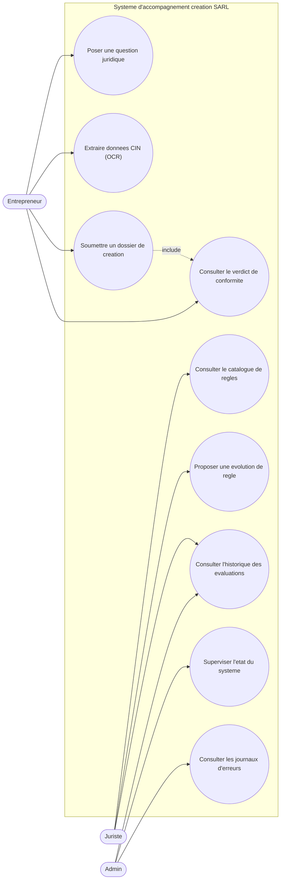
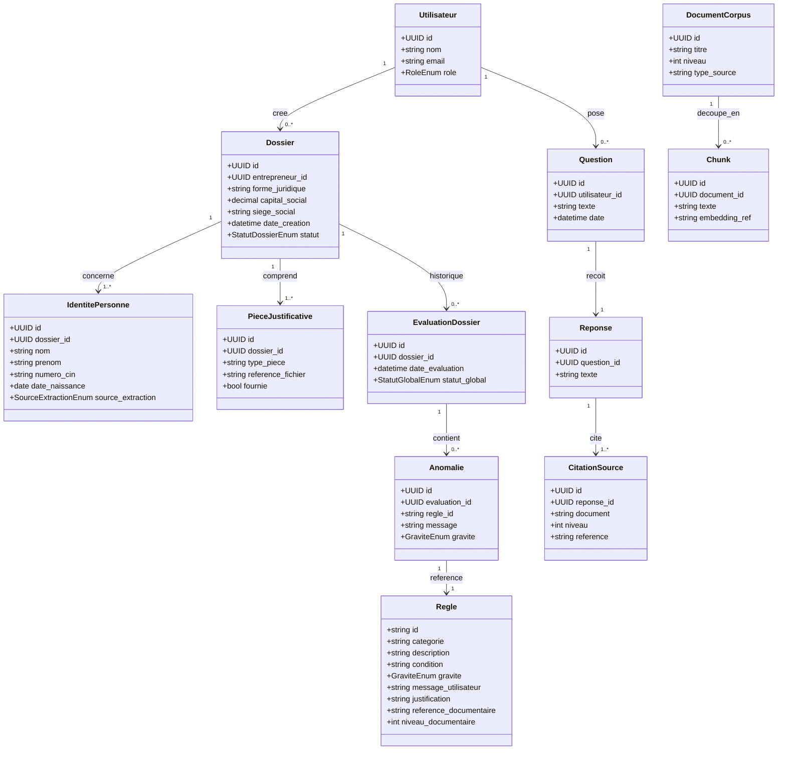
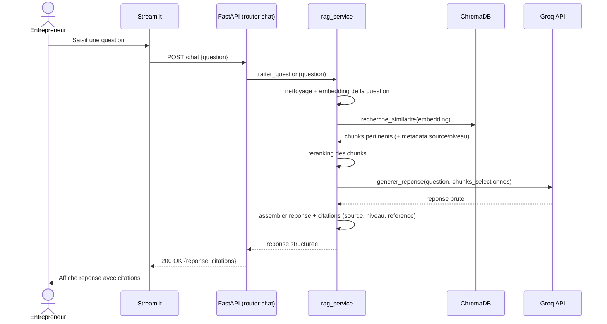
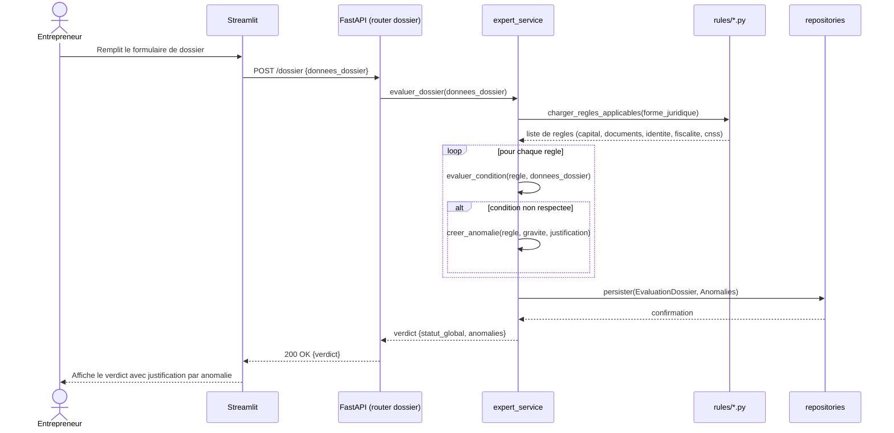
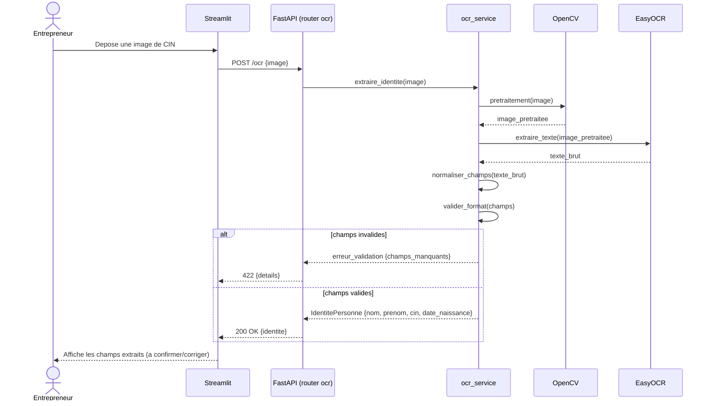
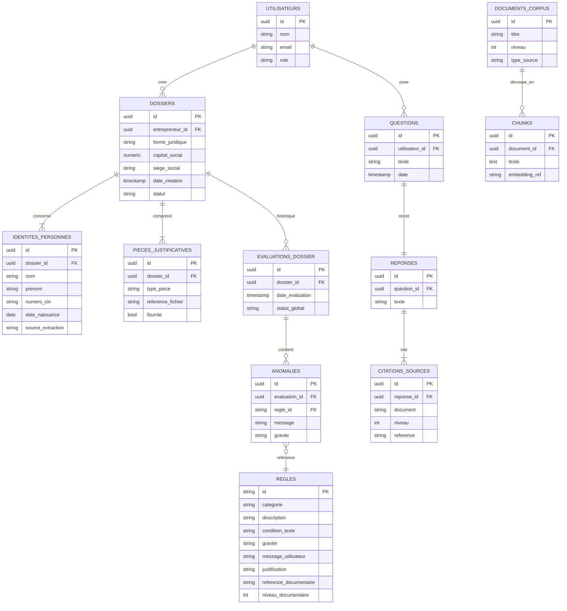

# UML.md — Conception UML (Phase 1)

**Statut : Phase 1 — En attente de validation**
**Dépend de** : `PROJECT.md` (§5.1 Acteurs), `ARCHITECTURE.md` (§7), `DECISIONS.md`
(section « Décisions de Phase 1 »).

---

## 1. Besoins fonctionnels (BF)

| ID | Acteur(s) | Besoin |
|---|---|---|
| BF-01 | Entrepreneur | Poser une question juridique en langage naturel et recevoir une réponse citant systématiquement source, niveau (1/2/3) et référence précise. |
| BF-02 | Entrepreneur | Soumettre une image de CIN et obtenir nom, prénom, numéro CIN, date de naissance, normalisés et validés. |
| BF-03 | Entrepreneur | Saisir un dossier structuré (forme juridique, capital, pièces fournies, siège social, identités des associés) et le soumettre à évaluation. |
| BF-04 | Entrepreneur | Consulter le verdict de conformité de son dossier : liste des anomalies, gravité, message utilisateur, justification et référence documentaire pour chacune. |
| BF-05 | Juriste | Consulter le catalogue des règles du système expert (catégorie, condition, source, niveau). |
| BF-06 | Juriste | Consulter l'historique des évaluations de dossiers (audit / amélioration continue des règles). |
| BF-07 | Juriste | Proposer une évolution de règle avec justification documentaire (validation hors-ligne humaine avant intégration au code — Règle absolue n°1 et n°2). |
| BF-08 | Admin | Consulter l'état de santé du système (API, base de données, index vectoriel). |
| BF-09 | Admin | Consulter les journaux d'erreurs applicatifs. |
| BF-10 | Tous | Recevoir un signalement explicite lorsque le corpus documentaire ne permet pas de répondre (plutôt qu'une réponse inventée — Règle absolue n°8). |

## 2. Besoins non fonctionnels (BNF)

| ID | Besoin | Statut |
|---|---|---|
| NFR-01 | Traçabilité : toute réponse/verdict doit référencer une règle et une source documentaire précise. | Exigence du prompt (Règle absolue n°7) |
| NFR-02 | Corpus fermé : aucune information juridique hors des documents fournis. | Exigence du prompt (Règle absolue n°1) |
| NFR-03 | Reproductibilité : `git clone` + `docker compose up` ou `pip install -r requirements.txt`, sans modification manuelle, sans secret en dur. | Exigence du prompt |
| NFR-04 | Protection des données personnelles extraites par OCR (minimisation, pas de stockage de l'image brute). | **Proposition technique — non issue du corpus**, à valider (cf. DECISIONS.md) |
| NFR-05 | Temps de réponse cible du chatbot RAG (indicatif). | **Proposition technique — non issue du corpus**, à valider |
| NFR-06 | Testabilité : couverture pytest (unitaire + intégration) sur chaque module. | Exigence du prompt |
| NFR-07 | Maintenabilité : architecture SOLID, séparation API/Services/Repositories/Models. | Exigence du prompt |
| NFR-08 | Portabilité : exécution via Docker, environnement standard. | Exigence du prompt |
| NFR-09 | Disponibilité mono-utilisateur local en V1 (pas de haute disponibilité requise). | Proposition validée dans DECISIONS.md |

---

## 3. Diagramme de cas d'utilisation

> Mermaid ne dispose pas d'une notation UML "cas d'utilisation" native ; la
> représentation ci-dessous utilise un flowchart avec une frontière de système
> (`subgraph`) contenant les cas d'utilisation, et les acteurs à l'extérieur —
> convention usuelle pour ce type de diagramme en Markdown/Mermaid.

**Relations notables** :
- `UC3 (Soumettre un dossier)` **include** `UC4 (Consulter le verdict)` : toute
  soumission produit systématiquement un verdict (aucune évaluation silencieuse).
- `UC7 (Consulter l'historique)` est partagé entre Juriste (amélioration des règles)
  et Admin (audit technique).

---

## 4. Diagramme de classes

**Note de conception** : `Regle` reste alignée sur la structure imposée par le prompt
(id, catégorie, description, condition, gravité, message_utilisateur, justification,
référence_documentaire, niveau_documentaire) — aucun champ ajouté ni retiré.

---

## 5. Diagrammes de séquence

### Scénario 1 — Question juridique au chatbot (module RAG)

### Scénario 2 — Soumission d'un dossier au système expert anti-rejet

### Scénario 3 — Extraction OCR d'une CIN

---

## 6. Modèle de données

**Correspondance avec la stack imposée** : ce modèle logique sera implémenté en
`backend/models/*.py` (SQLAlchemy 2.x, tables `PostgreSQL`) et migré via Alembic en
Phase 2 (Fondations techniques). `CHUNKS.embedding_ref` référence un identifiant côté
`ChromaDB` (les vecteurs eux-mêmes ne sont pas dupliqués en PostgreSQL).

---

## 7. Information manquante signalée (Règle absolue n°8)

- Aucune donnée du corpus ne définit un modèle de rôles applicatifs, un modèle de
  données technique, ou des seuils de performance : tout le contenu de ce document
  au-delà des règles métier (capital, formes juridiques, documents) est une
  **proposition de conception**, pas une extraction du corpus documentaire.
- Les règles métier elles-mêmes (`Regle.condition`, `reference_documentaire`,
  `niveau_documentaire`) ne seront formalisées avec leur contenu réel qu'en Phase 3
  (Système expert) — ce document ne fait qu'en fixer la structure.
